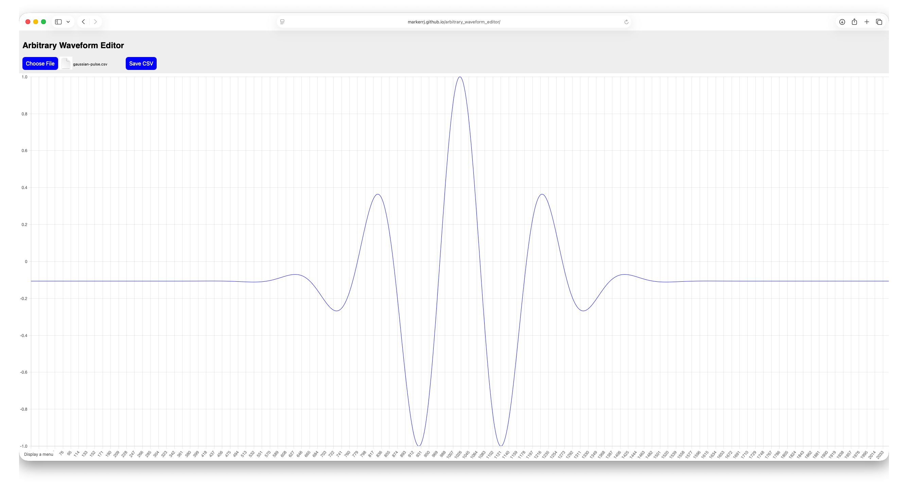
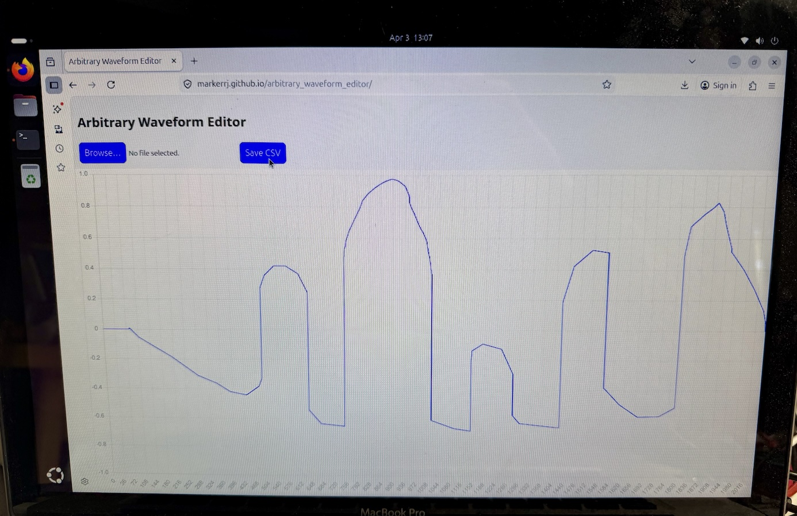
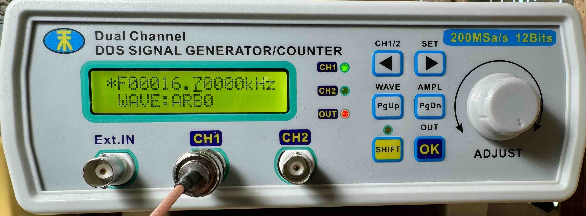
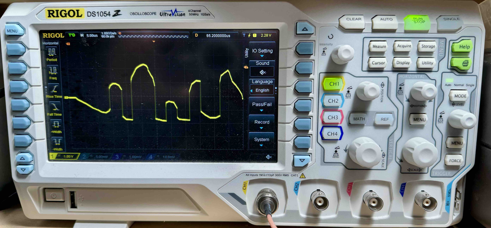

# Arbitrary Waveform Editor
Simple web app to load, edit, and save arbitrary waveforms for use with a signal generator.

https://markerrj.github.io/arbitrary_waveform_editor/

* 2048 points
* -1 to 1 values
* Load existing .csv files with 2048 points, lines starting with # ignored
* Use a mouse pointer to drag and edit the displayed curve
* Interpolation of mouse coordinates for smooth curve editing
* Save output .csv file

Use Case Example
----------------

Here I visited https://markerrj.github.io/arbitrary_waveform_editor/ on a laptop and drew a waveform:

I then saved the waveform and used the excellent [peterska/go-mhs5200a](https://github.com/peterska/go-mhs5200a) to upload the waveform to my signal generator:

I could then view the same arbitrary waveform on my (somewhat dirty) oscillosope:

Contact
-------
Please use [Github issue tracker](https://github.com/markerrj/arbitrary_waveform_editor/issues) for filing bugs or feature requests.

Notes
-----

Special thanks to `peterska` for his work on [peterska/go-mhs5200a](https://github.com/peterska/go-mhs5200a). There are also a set of arbitrary waveform .csv files in
https://github.com/peterska/go-mhs5200a/tree/main/waves that can be used with this web app.

Also, as noted in that repository README, the MHS-5200A work was all based on the work by [wd5gnr/mhs5200a](https://github.com/wd5gnr/mhs5200a).
